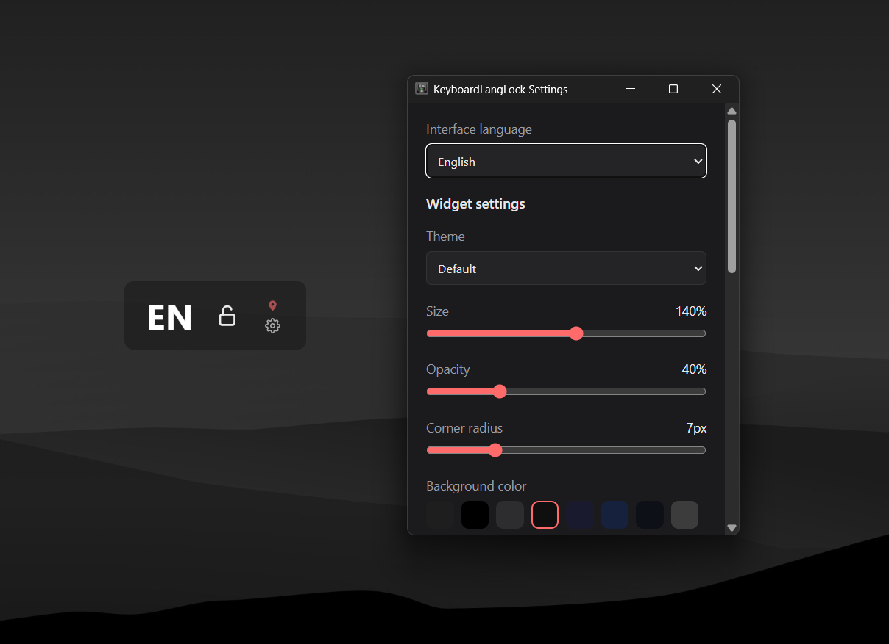

# WindowsLanguageWidget

A lightweight Windows 11 desktop widget that shows the active window's keyboard layout and lets you **lock it** — built to stop games that use `Alt+Shift` as a game action from accidentally triggering a system-wide language switch.

Built with [Tauri](https://tauri.app) (Rust + WebView2), so it stays light on RAM (~50 MB).



## Features

- Shows the layout of the **active window** (EN / UK …), not the widget itself
- Lock the layout — a soft snap-back by default, or an optional **hard block** that fully disables the language hotkey while locked, so games never see a switch (see below)
- `Win+Space` and the taskbar language indicator keep working even while locked — deliberate switches stay possible
- Pin the widget's position (drag it by the pill or the language label when unpinned)
- Five built-in themes, or write your own CSS
- Show/hide the lock, pin, and settings buttons independently
- Autostart with Windows, toggled right from the settings panel
- Ukrainian / English interface
- One-click reset back to defaults
- Single-instance: launching a second copy just surfaces the running one
- Checks GitHub for a newer release and links to it from Settings
- Settings persist across restarts

## Install

Download the latest `.exe` from [Releases](../../releases) and run it.
Windows SmartScreen may warn on first run since the installer isn't code-signed — click *More info → Run anyway*.
The WebView2 runtime it needs ships with Windows 11 by default.

## Usage

| Action | Effect |
|---|---|
| Click the lock icon | Lock / unlock the current layout |
| Click the pin icon | Lock / unlock the widget's position |
| Click the gear icon, or right-click the widget | Open the settings panel |
| Tray icon → right-click | Settings / Exit |

## Settings

| Setting | Effect |
|---|---|
| Theme | Switch between the built-in looks (see below) |
| Size / Opacity / Corner radius | Fine-tune the widget's appearance |
| Background color | Pick a preset swatch or enter a hex value |
| Always on top | Keep the widget above other windows |
| Start with Windows | Autostart on login (kept in sync with the tray menu) |
| Hard-block layout switch while locked | **Experimental, off by default.** While locked, fully disables the Windows language hotkey (keyboard hook + registry `HKCU\Keyboard Layout\Toggle` + `SPI_SETLANGTOGGLE`), so `Alt+Shift` / `Ctrl+Shift` never fire a switch and games never see a language change. `Win+Space` still works. See below before enabling. |
| Visible buttons | Show/hide the lock, pin, and settings buttons independently |
| Custom CSS | Advanced styling, see below |
| Reset to defaults | Restores appearance settings; keeps the widget's position and current lock state |

### Themes

- **Default** — dark pill, red lock accent
- **Windows 11 Light** — light card matching Windows 11's light theme
- **Windows 11 Dark** — Mica-style dark card matching Windows 11's dark theme
- **Minimal** — flat and low-opacity; buttons fade in on hover
- **Futuristic** — neon glow, monospace, controls stacked vertically

Picking a theme sets its default size/opacity/color, which you can still fine-tune afterward with the sliders.

### Custom CSS

The settings panel has a **Custom CSS** field for styling the widget beyond what the built-in themes offer. It's injected directly into the widget's page, so any valid CSS works. Useful selectors:

| Selector | Targets |
|---|---|
| `#card` | The whole pill (background, border, shadow, font) |
| `#lang` | The language label |
| `#lock`, `#pin`, `#gear` | The three buttons |
| `.card.locked` | Applied to `#card` while the layout is locked |
| `.card.pinned` | Applied to `#card` while the position is pinned |

Example — bigger, green language text:

```css
#lang { color: #00ff88; font-size: 1.2em; }
```

### "Hard-block layout switch while locked" — what it does

By default, locking only snaps the layout back after a switch — which some games notice as a brief change. Enable this option for a true block: while locked it disables the Windows language hotkey on two levels — a low-level keyboard hook, plus temporarily setting `HKCU\Keyboard Layout\Toggle` to "no hotkey" and applying it instantly via `SystemParametersInfoW(SPI_SETLANGTOGGLE)`. `Alt+Shift` / `Ctrl+Shift` become ordinary keys to Windows — there is no layout-switch event at all, which is the only approach some games respect. `Win+Space` and the taskbar language indicator keep working.

It's off by default because it writes to the registry. Your original values are restored automatically on: unlock, app exit, the app's next launch (crash-recovery backup), and — worst case — the next Windows logon (a `RunOnce` restore entry is registered while the hotkey is disabled).

**Manual recovery**, if the hotkey ever stays off (e.g. hard power loss and you never launch the widget again): Windows Settings → *Time & language* → *Typing* → *Advanced keyboard settings* → *Input language hot keys*, and set the key sequence back — or delete the `Language Hotkey`, `Layout Hotkey`, and `Hotkey` values under `HKCU\Keyboard Layout\Toggle` and sign out/in.

## Known limitation

In **exclusive fullscreen** games the widget isn't visible and layout enforcement may not apply. Use borderless/windowed mode.

## Build from source

Prerequisites:

- [Rust](https://rustup.rs) (stable, MSVC toolchain — the default on Windows)
- [Microsoft C++ Build Tools](https://visualstudio.microsoft.com/visual-cpp-build-tools/)
- [Node.js](https://nodejs.org)
- WebView2 runtime (preinstalled on Windows 11)

```bash
npm install
npm run dev      # run in development
npm run build    # produce the installer in src-tauri/target/release/bundle
```

## Release

Push a `v*` tag to trigger the CI build on GitHub:

```bash
git tag v1.0.0
git push origin v1.0.0
```

The workflow builds on `windows-latest` (MSVC + WebView2 already present) and attaches the `.exe` to the Release.

## License

[MIT](LICENSE)

## Author

[Mykola Moskal](https://www.linkedin.com/in/mykola-moskal-228749194)
